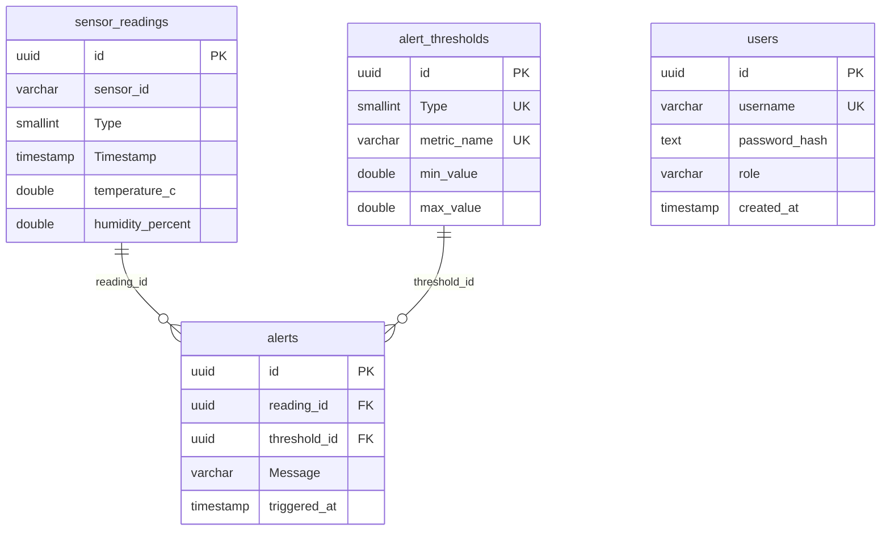

# AirAware – Backend-Dokumentation

**Projektname:** UmweltMonitor 3000 (AirAware)  
**Lernfeld 7:** Cyber-physische Systeme ergänzen  
**Autor Backend:** Moritz Mäxa  
**Stand:** Mai 2026

---

## Inhaltsverzeichnis

1. [Technisches Konzept](#1-technisches-konzept)
2. [Klassendiagramm](#2-klassendiagramm)
3. [Datenbankschema](#3-datenbankschema)
4. [API-Dokumentation](#4-api-dokumentation)
5. [Sicherheitskonzept](#5-sicherheitskonzept)
6. [Deployment & Infrastruktur](#6-deployment--infrastruktur)

---

## 1. Technisches Konzept

### 1.1 Systemübersicht

AirAware ist ein Echtzeit-Umweltüberwachungssystem, das Sensordaten (Temperatur und Luftfeuchtigkeit) von einem ESP32-Mikrocontroller über das MQTT-Protokoll an ein ASP.NET-Backend sendet. Die Daten werden in einer PostgreSQL-Datenbank gespeichert und über eine REST-API für das React-Frontend bereitgestellt.

### 1.2 Architektur-Übersicht

```
┌─────────────┐     MQTT (WSS)      ┌──────────────────────────────────────────────┐
│   ESP32      │ ──────────────────► │          Windows Server 2025                 │
│  (SHT20 +   │   via Cloudflare    │                                              │
│   MQ2)       │      Tunnel         │  ┌──────────────┐    ┌──────────────────┐   │
└─────────────┘                      │  │  Mosquitto    │    │  ASP.NET 10      │   │
                                     │  │  MQTT Broker  │───►│  Backend (API)   │   │
                                     │  │  Port 1883    │    │  Port 5000       │   │
                                     │  └──────────────┘    └───────┬──────────┘   │
                                     │                              │              │
                                     │                     ┌────────▼─────────┐    │
                                     │                     │  PostgreSQL 18   │    │
                                     │                     │  Port 5432       │    │
                                     │                     └──────────────────┘    │
                                     └──────────────────────────────────────────────┘
                                              │ Cloudflare Tunnel
                                              ▼
                                     ┌──────────────────┐
                                     │  Cloudflare Edge  │
                                     │  api.air-aware.de │
                                     └────────┬─────────┘
                                              │ HTTPS
                                              ▼
                                     ┌──────────────────┐
                                     │  React Frontend   │
                                     │  (Cloudflare      │
                                     │   Pages + Worker) │
                                     └──────────────────┘
```

### 1.3 Datenfluss

1. **ESP32** liest Sensordaten (SHT20: Temperatur/Luftfeuchtigkeit) alle 30 Sekunden aus.
2. **ESP32** sendet zwei separate JSON-Nachrichten per MQTT:
   - Topic `esp32/sensor/temperature` → Temperaturwert
   - Topic `esp32/sensor/humidity` → Luftfeuchtigkeitswert
3. **Mosquitto Broker** (lokal auf dem Server, Port 1883) empfängt die Nachrichten.
4. **MqttSubscriberService** (ASP.NET BackgroundService) ist auf `esp32/sensor/#` subscribed, parst die JSON-Payloads über den `SensorDataConverter` und speichert die Messwerte in der PostgreSQL-Datenbank.
5. Bei jedem eingehenden Messwert werden automatisch die **Schwellenwerte** (AlertThresholds) geprüft. Bei Überschreitungen werden **Alarme** (Alerts) in der Datenbank gespeichert.
6. Das **React-Frontend** ruft über die REST-API die aktuellen Daten, Historie, Berichte und Alarme ab.

### 1.4 Technologie-Stack

| Komponente | Technologie | Version |
|---|---|---|
| Backend-Framework | ASP.NET (Minimal Hosting) | .NET 10 |
| Datenbank | PostgreSQL | 18 |
| ORM | Entity Framework Core (Npgsql) | 10.0.0 |
| MQTT-Client | MQTTnet | 4.3.7 |
| Authentifizierung | JWT Bearer Token | — |
| Passwort-Hashing | BCrypt.Net-Next | 4.1.0 |
| API-Dokumentation | Swagger (Swashbuckle) | 10.1.4 |
| Betriebssystem (Server) | Windows Server 2025 | — |
| Tunneling | Cloudflare Tunnel (cloudflared) | — |
| Fernwartung | RustDesk | — |

### 1.5 Kommunikationsprotokoll (MQTT)

Der ESP32 sendet Daten im folgenden JSON-Format:

**Temperatur:**
```json
{
  "sensor_id": "esp32-01",
  "type": "temperature",
  "temp_c": 23.5
}
```

**Luftfeuchtigkeit:**
```json
{
  "sensor_id": "esp32-01",
  "type": "humidity",
  "humidity_pct": 61.2
}
```

| Feld | Typ | Beschreibung |
|---|---|---|
| `sensor_id` | string | Eindeutige Kennung des Sensors |
| `type` | string | `"temperature"` oder `"humidity"` |
| `temp_c` | float | Temperatur in °C (nur bei type=temperature) |
| `humidity_pct` | float | Relative Luftfeuchtigkeit in % (nur bei type=humidity) |
| `ts` | long | Unix-Timestamp in Sekunden (optional, sonst UTC-Now) |

Die MQTT-Verbindung vom ESP32 erfolgt über **WebSocket Secure (WSS)** durch den Cloudflare Tunnel (`wss://mqtt.air-aware.de:443/`), sodass die Daten verschlüsselt übertragen werden.

---

## 2. Klassendiagramm

### 2.1 Backend-Klassendiagramm (UML)

```mermaid
classDiagram
    direction TB

    class Program {
        <<Einstiegspunkt>>
        +Main()
        Konfiguration: JWT, MQTT, CORS, DB
    }

    %% === Controller ===
    class AuthController {
        -JwtOptions _jwt
        -AirAwareDbContext db
        -TokenBlacklistService blacklist
        +Register(RegisterRequest) ActionResult
        +Login(LoginRequest) ActionResult~LoginResponse~
        +ChangePassword(ChangePasswordRequest) ActionResult
        +Logout() ActionResult
        +DeleteUser(username) ActionResult
    }

    class SensorDataController {
        -AirAwareDbContext db
        +GetLatest() ActionResult~IEnumerable~SensorReading~~
        +GetHistory(type?, from?, to?, count) ActionResult
        +GetReport(from?, to?) ActionResult~SensorReport~
        +GetReportCsv(from?, to?) IActionResult
        +GetThresholds() ActionResult
        +SetThreshold(AlertThreshold) ActionResult
        +DeleteThreshold(SensorType) ActionResult
        +GetAlerts() ActionResult
        +GenerateMockData() ActionResult
        +DeleteMockData() ActionResult
        -BuildReport(from?, to?) SensorReport
        -CalculateMedian(values) double
    }

    %% === Services ===
    class MqttSubscriberService {
        -IMqttClient _mqttClient
        -MqttOptions _options
        -IServiceScopeFactory scopeFactory
        #ExecuteAsync(CancellationToken) Task
        -ConnectWithRetryAsync(ct) Task
        -ConnectAsync(ct) Task
        -OnMessageReceivedAsync(e) Task
        +StopAsync(ct) Task
        +Dispose()
    }

    class TokenBlacklistService {
        -ConcurrentDictionary _revokedTokens
        +Revoke(jti, expiresUtc)
        +IsRevoked(jti) bool
        -Cleanup()
    }

    %% === Models ===
    class SensorReading {
        +Guid Id
        +string SensorId
        +SensorType Type
        +DateTime Timestamp
        +double? TemperatureC
        +double? TemperatureF [berechnet]
        +double? HumidityPercent
    }

    class AlertThreshold {
        +Guid Id
        +SensorType Type
        +string MetricName
        +double MinValue
        +double MaxValue
    }

    class Alert {
        +Guid Id
        +Guid ReadingId
        +SensorReading Reading
        +Guid ThresholdId
        +AlertThreshold Threshold
        +string Message
        +DateTime TriggeredAt
    }

    class User {
        +Guid Id
        +string Username
        +string PasswordHash
        +string Role
        +DateTime CreatedAt
    }

    class SensorReport {
        +DateTime From
        +DateTime To
        +int TotalReadings
        +int TemperatureReadings
        +int HumidityReadings
        +double? AvgTemperatureC
        +double? MinTemperatureC
        +double? MaxTemperatureC
        +double? MedianTemperatureC
        +double? AvgTemperatureF
        +double? AvgHumidityPercent
        +double? MedianHumidityPercent
        +int AlertCount
    }

    class SensorType {
        <<enumeration>>
        Temperature = 0
        Humidity = 1
    }

    %% === DTOs ===
    class LoginRequest {
        +string Username
        +string Password
    }
    class LoginResponse {
        +string Token
        +DateTime ExpiresAt
    }
    class RegisterRequest {
        +string Username
        +string Password
    }
    class ChangePasswordRequest {
        +string CurrentPassword
        +string NewPassword
    }

    %% === Hilfsklassen ===
    class SensorDataConverter {
        <<static>>
        +Parse(rawJson) SensorReading
        +TryParse(rawJson, out reading) bool
        -ParseSensorType(type) SensorType
    }

    class AlertHelper {
        <<static>>
        +EvaluateAlerts(readings, thresholds) List~Alert~
    }

    %% === Data ===
    class AirAwareDbContext {
        +DbSet~SensorReading~ SensorReadings
        +DbSet~AlertThreshold~ AlertThresholds
        +DbSet~Alert~ Alerts
        +DbSet~User~ Users
        #OnModelCreating(ModelBuilder)
    }

    %% === Configuration ===
    class JwtOptions {
        +string Secret
        +string Issuer
        +string Audience
        +int ExpirationMinutes
    }

    class MqttOptions {
        +string Host
        +int Port
        +string Topic
        +string ClientId
        +string Username
        +string Password
    }

    %% === Middleware ===
    class AdminPinAuthMiddleware {
        -MaxFailedAttempts = 3
        -LockoutDuration = 15min
        +InvokeAsync(HttpContext)
        -IsLockedOut(clientIp) bool
        -RecordFailedAttempt(clientIp)
    }

    class ApiKeyAuthMiddleware {
        +InvokeAsync(HttpContext)
    }

    %% === Beziehungen ===
    AuthController --> AirAwareDbContext
    AuthController --> JwtOptions
    AuthController --> TokenBlacklistService
    AuthController ..> LoginRequest
    AuthController ..> LoginResponse
    AuthController ..> RegisterRequest
    AuthController ..> ChangePasswordRequest
    AuthController ..> User

    SensorDataController --> AirAwareDbContext
    SensorDataController ..> SensorReading
    SensorDataController ..> AlertThreshold
    SensorDataController ..> Alert
    SensorDataController ..> SensorReport
    SensorDataController --> AlertHelper

    MqttSubscriberService --> MqttOptions
    MqttSubscriberService --> AirAwareDbContext
    MqttSubscriberService --> SensorDataConverter
    MqttSubscriberService --> AlertHelper

    SensorDataConverter ..> SensorReading
    AlertHelper ..> Alert
    AlertHelper ..> SensorReading
    AlertHelper ..> AlertThreshold

    AirAwareDbContext --> SensorReading
    AirAwareDbContext --> AlertThreshold
    AirAwareDbContext --> Alert
    AirAwareDbContext --> User

    Alert --> SensorReading : ReadingId
    Alert --> AlertThreshold : ThresholdId

    SensorReading --> SensorType
    AlertThreshold --> SensorType

    Program --> AuthController
    Program --> SensorDataController
    Program --> MqttSubscriberService
    Program --> TokenBlacklistService
    Program --> AdminPinAuthMiddleware
    Program --> ApiKeyAuthMiddleware
```



### 2.2 Komponentenübersicht

| Ordner | Inhalt | Beschreibung |
|---|---|---|
| `Controllers/` | `AuthController`, `SensorDataController` | REST-API-Endpunkte |
| `Services/` | `MqttSubscriberService`, `TokenBlacklistService` | Hintergrund- und Hilfs-Services |
| `Models/` | `SensorReading`, `Alert`, `AlertThreshold`, `User`, DTOs | Datenmodelle und Transfer-Objekte |
| `Data/` | `AirAwareDbContext` | Entity Framework Datenbankkontext |
| `Configuration/` | `JwtOptions`, `MqttOptions` | Konfigurationsklassen (Options-Pattern) |
| `Converters/` | `SensorDataConverter` | JSON-Parsing der ESP32-Payloads |
| `Helpers/` | `AlertHelper` | Schwellenwert-Auswertungslogik |
| `Middleware/` | `AdminPinAuthMiddleware`, `ApiKeyAuthMiddleware` | Zusätzliche Authentifizierungs-Middleware |
| `Attributes/` | `RequireAdminPinAttribute`, `RequireApiKeyAttribute` | Marker-Attribute für Middleware |
| `Swagger/` | `AdminPinOperationFilter`, `ApiKeyOperationFilter` | Swagger-UI-Erweiterungen |

---

## 3. Datenbankschema

### 3.1 ER-Diagramm



### 3.2 Tabellenbeschreibung

#### `sensor_readings` – Sensormesswerte

| Spalte | Typ | Beschreibung |
|---|---|---|
| `id` | UUID (PK) | Eindeutige ID, automatisch generiert |
| `sensor_id` | VARCHAR | Kennung des Sensors (z.B. `esp32-01`) |
| `Type` | SMALLINT | Sensortyp: `0` = Temperature, `1` = Humidity |
| `Timestamp` | TIMESTAMP WITH TIME ZONE | Zeitpunkt der Messung (UTC) |
| `temperature_c` | DOUBLE PRECISION | Temperatur in °C (NULL bei Humidity-Typ) |
| `humidity_percent` | DOUBLE PRECISION | Luftfeuchtigkeit in % (NULL bei Temperature-Typ) |

> **Hinweis:** Die Temperatur in Fahrenheit (`TemperatureF`) wird **nicht** in der Datenbank gespeichert, sondern zur Laufzeit im Model berechnet: `°F = 32 + °C × 9/5`.

#### `alert_thresholds` – Schwellenwert-Konfiguration

| Spalte | Typ | Beschreibung |
|---|---|---|
| `id` | UUID (PK) | Eindeutige ID |
| `Type` | SMALLINT (UNIQUE) | Sensortyp (nur ein Threshold pro Typ erlaubt) |
| `metric_name` | VARCHAR (UNIQUE) | Metrikname: `TemperatureC` oder `HumidityPercent` |
| `min_value` | DOUBLE PRECISION | Untere Grenze des erlaubten Bereichs |
| `max_value` | DOUBLE PRECISION | Obere Grenze des erlaubten Bereichs |

#### `alerts` – Ausgelöste Alarme

| Spalte | Typ | Beschreibung |
|---|---|---|
| `id` | UUID (PK) | Eindeutige ID |
| `reading_id` | UUID (FK → sensor_readings) | Referenz auf den auslösenden Messwert |
| `threshold_id` | UUID (FK → alert_thresholds) | Referenz auf den verletzten Schwellenwert |
| `Message` | VARCHAR | Beschreibung der Verletzung |
| `triggered_at` | TIMESTAMP | Zeitpunkt der Alarmerstellung |

#### `users` – Benutzer

| Spalte | Typ | Beschreibung |
|---|---|---|
| `id` | UUID (PK) | Eindeutige ID |
| `username` | VARCHAR(100) (UNIQUE) | Benutzername |
| `password_hash` | TEXT | BCrypt-Hash des Passworts |
| `role` | VARCHAR(50) | Rolle (Standard: `Admin`) |
| `created_at` | TIMESTAMP | Erstellungszeitpunkt |

### 3.3 PostgreSQL Performance-Konfiguration

Der Server (32 GB RAM, 12 Kerne, SSD) wurde mit folgenden Parametern optimiert:

| Parameter | Wert | Zweck |
|---|---|---|
| `shared_buffers` | 8 GB | Hauptspeicher-Cache für DB-Seiten |
| `effective_cache_size` | 20 GB | Geschätzter verfügbarer Speicher für Caching |
| `work_mem` | 16 MB | Arbeitsspeicher pro Sortier-/Hash-Operation |
| `max_connections` | 600 | Maximale gleichzeitige Verbindungen |
| `random_page_cost` | 1.1 | Optimiert für SSD-Zugriffsmuster |
| `max_wal_size` | 8 GB | Maximale WAL-Größe vor Checkpoint |

---

## 4. API-Dokumentation

Die API ist unter `https://api.air-aware.de/api/` erreichbar. In der Entwicklungsumgebung steht Swagger UI unter `http://localhost:5000/swagger` zur Verfügung.

### 4.1 Authentifizierung (AuthController)

#### `POST /api/Auth/login` – Benutzer anmelden

Gibt ein JWT-Bearer-Token zurück, das für geschützte Endpoints verwendet wird.

**Request:**
```json
{
  "username": "admin",
  "password": "geheim123"
}
```

**Response (200 OK):**
```json
{
  "token": "eyJhbGciOiJIUzI1NiIsInR5cCI6IkpXVCJ9...",
  "expiresAt": "2026-05-03T16:30:00"
}
```

**Response (401 Unauthorized):**
```json
{
  "error": "Ungültiger Benutzername oder Passwort."
}
```

---

#### `POST /api/Auth/register` – Neuen Benutzer registrieren

Erfordert ein gültiges JWT-Token (nur eingeloggte Admins dürfen neue Benutzer anlegen).

**Header:** `Authorization: Bearer <token>`

**Request:**
```json
{
  "username": "neuerUser",
  "password": "sicheresPasswort"
}
```

**Response (200 OK):**
```json
{
  "message": "Benutzer erfolgreich registriert.",
  "username": "neuerUser"
}
```

**Response (409 Conflict):**
```json
{
  "error": "Benutzername ist bereits vergeben."
}
```

---

#### `POST /api/Auth/change-password` – Passwort ändern

**Header:** `Authorization: Bearer <token>`

**Request:**
```json
{
  "currentPassword": "altesPasswort",
  "newPassword": "neuesPasswort"
}
```

**Response (200 OK):**
```json
{
  "message": "Passwort erfolgreich geändert."
}
```

---

#### `POST /api/Auth/logout` – Abmelden

Widerruft das aktuelle JWT-Token (Token-Blacklist).

**Header:** `Authorization: Bearer <token>`

**Response (200 OK):**
```json
{
  "message": "Erfolgreich abgemeldet. Token wurde widerrufen."
}
```

---

#### `DELETE /api/Auth/user/{username}` – Benutzer löschen

**Header:** `Authorization: Bearer <token>`

**Response (200 OK):**
```json
{
  "message": "Benutzer 'username' wurde gelöscht."
}
```

---

### 4.2 Sensordaten (SensorDataController)

#### `GET /api/SensorData/latest` – Aktuellste Messwerte

Gibt den neuesten Messwert pro Sensortyp (Temperatur und Luftfeuchtigkeit) zurück.

**Response (200 OK):**
```json
[
  {
    "id": "0a49f066-4a0e-4d55-ae53-31b2d62b1...",
    "sensorId": "esp32-01",
    "type": 0,
    "timestamp": "2026-04-30T13:44:23.618Z",
    "temperatureC": 20.0,
    "temperatureF": 68.0,
    "humidityPercent": null
  },
  {
    "id": "f8e8066d-ed14-4a35-a46a-4513d74b8...",
    "sensorId": "esp32-01",
    "type": 1,
    "timestamp": "2026-04-30T13:44:23.623Z",
    "temperatureC": null,
    "temperatureF": null,
    "humidityPercent": 40.0
  }
]
```

---

#### `GET /api/SensorData/history` – Messhistorie

| Parameter | Typ | Standard | Beschreibung |
|---|---|---|---|
| `type` | int? | — | Sensortyp: `0` = Temperature, `1` = Humidity |
| `from` | DateTime? | — | Startdatum (UTC) |
| `to` | DateTime? | — | Enddatum (UTC) |
| `count` | int | 50 | Maximale Anzahl Ergebnisse |

**Beispiel:** `GET /api/SensorData/history?type=0&count=10`

---

#### `GET /api/SensorData/report` – Zusammenfassender Bericht

Berechnet statistische Kennzahlen über die Messdaten (Durchschnitt, Median, Min/Max).

| Parameter | Typ | Beschreibung |
|---|---|---|
| `from` | DateTime? | Startdatum (optional) |
| `to` | DateTime? | Enddatum (optional) |

**Response (200 OK):**
```json
{
  "from": "2026-04-30T13:44:23Z",
  "to": "2026-05-03T10:15:00Z",
  "totalReadings": 500,
  "temperatureReadings": 250,
  "humidityReadings": 250,
  "avgTemperatureC": 21.3,
  "minTemperatureC": 18.0,
  "maxTemperatureC": 28.5,
  "medianTemperatureC": 21.0,
  "avgTemperatureF": 70.3,
  "minTemperatureF": 64.4,
  "maxTemperatureF": 83.3,
  "avgHumidityPercent": 45.2,
  "minHumidityPercent": 30.0,
  "maxHumidityPercent": 72.0,
  "medianHumidityPercent": 44.0,
  "alertCount": 12
}
```

---

#### `GET /api/SensorData/report/csv` – Bericht als CSV-Download

Gleiche Filter wie `/report`. Gibt eine CSV-Datei mit allen Einzelmesswerten und einer Zusammenfassung am Ende zurück.

**Dateiname:** `AirAware_Report_20260430_20260503.csv`

---

#### `GET /api/SensorData/thresholds` – Schwellenwerte abrufen

**Response (200 OK):**
```json
[
  {
    "id": "a1b2c3d4-...",
    "type": 0,
    "metricName": "TemperatureC",
    "minValue": 18.0,
    "maxValue": 30.0
  }
]
```

---

#### `POST /api/SensorData/thresholds` – Schwellenwert setzen/aktualisieren

Pro Sensortyp ist nur ein Schwellenwert erlaubt. Existiert bereits einer, wird er überschrieben.

**Header:** `Authorization: Bearer <token>`

**Request:**
```json
{
  "type": 0,
  "metricName": "TemperatureC",
  "minValue": 18.0,
  "maxValue": 30.0
}
```

**Validierung:**
- `metricName` muss `"TemperatureC"` oder `"HumidityPercent"` sein
- `minValue` muss kleiner als `maxValue` sein

---

#### `DELETE /api/SensorData/thresholds/{type}` – Schwellenwert löschen

**Header:** `Authorization: Bearer <token>`

**Beispiel:** `DELETE /api/SensorData/thresholds/0` (löscht Temperature-Threshold)

---

#### `GET /api/SensorData/alerts` – Ausgelöste Alarme abrufen

Prüft alle Messdaten gegen die konfigurierten Schwellenwerte und gibt die Verletzungen zurück.

**Response (200 OK):**
```json
[
  {
    "id": "...",
    "readingId": "...",
    "thresholdId": "...",
    "message": "TemperatureC = 35.2 liegt außerhalb des Bereichs [18 – 30]",
    "triggeredAt": "2026-04-30T14:22:00Z"
  }
]
```

---

#### `POST /api/SensorData/mock` – Testdaten generieren

Erzeugt 100 Testmesswerte (50× Temperatur + 50× Luftfeuchtigkeit) über die letzten ~4 Stunden. Sensor-ID: `esp32-mock`.

**Header:** `Authorization: Bearer <token>`

---

#### `DELETE /api/SensorData/mock` – Testdaten löschen

Entfernt alle Messwerte mit `sensor_id = "esp32-mock"` und zugehörige Alarme.

**Header:** `Authorization: Bearer <token>`

---

### 4.3 Endpunkt-Übersicht

| Methode | Endpunkt | Auth | Beschreibung |
|---|---|---|---|
| POST | `/api/Auth/login` | — | Benutzer anmelden |
| POST | `/api/Auth/register` | JWT | Benutzer registrieren |
| POST | `/api/Auth/change-password` | JWT | Passwort ändern |
| POST | `/api/Auth/logout` | JWT | Token widerrufen |
| DELETE | `/api/Auth/user/{username}` | JWT | Benutzer löschen |
| GET | `/api/SensorData/latest` | — | Neueste Messwerte |
| GET | `/api/SensorData/history` | — | Messhistorie (mit Filtern) |
| GET | `/api/SensorData/report` | — | Statistischer Bericht |
| GET | `/api/SensorData/report/csv` | — | Bericht als CSV-Download |
| GET | `/api/SensorData/thresholds` | — | Schwellenwerte abrufen |
| POST | `/api/SensorData/thresholds` | JWT | Schwellenwert setzen |
| DELETE | `/api/SensorData/thresholds/{type}` | JWT | Schwellenwert löschen |
| GET | `/api/SensorData/alerts` | — | Alarme abrufen |
| POST | `/api/SensorData/mock` | JWT | Testdaten generieren |
| DELETE | `/api/SensorData/mock` | JWT | Testdaten löschen |

---

## 5. Sicherheitskonzept

### 5.1 Authentifizierung – JWT Bearer Token

Die API verwendet **JSON Web Tokens (JWT)** zur Authentifizierung. Der Ablauf:

1. Benutzer sendet Username/Passwort an `POST /api/Auth/login`.
2. Backend prüft die Credentials gegen die Datenbank (BCrypt-Vergleich).
3. Bei Erfolg wird ein JWT-Token generiert mit:
   - **Claims:** Benutzername, Rolle, eindeutige Token-ID (JTI)
   - **Algorithmus:** HMAC-SHA256
   - **Gültigkeit:** 60 Minuten (konfigurierbar)
   - **Issuer/Audience:** `AirAware`
4. Der Client sendet das Token bei geschützten Requests im `Authorization: Bearer <token>` Header.

### 5.2 Passwort-Sicherheit – BCrypt

- Passwörter werden **niemals** im Klartext gespeichert.
- Es wird **BCrypt** (Bibliothek: BCrypt.Net-Next) zum Hashen verwendet.
- BCrypt enthält einen integrierten Salt und einen konfigurierbaren Work-Factor, der Brute-Force-Angriffe erschwert.

### 5.3 Token-Blacklist (Logout)

- Beim Logout wird die **JTI** (JWT ID) des Tokens auf eine In-Memory-Blacklist gesetzt.
- Bei jeder Anfrage mit JWT wird geprüft, ob die JTI widerrufen wurde (`OnTokenValidated` Event).
- Abgelaufene Einträge werden automatisch aus der Blacklist bereinigt (`Cleanup()`).
- Die Blacklist ist als `ConcurrentDictionary` implementiert und damit thread-safe.

### 5.4 Admin-PIN Middleware

Für besonders sensible Endpoints (Schwellenwert-Verwaltung) kann ein zusätzlicher **Admin-PIN** über den Header `X-Admin-Pin` verlangt werden.

**Brute-Force-Schutz:**
- Nach **3 fehlgeschlagenen Versuchen** wird die IP-Adresse für **15 Minuten** gesperrt (HTTP 429).
- Fehlversuche werden pro IP in einem `ConcurrentDictionary` gezählt.
- Bei erfolgreichem Login wird der Zähler zurückgesetzt.
- In der **Development-Umgebung** wird die PIN-Prüfung übersprungen.

### 5.5 API-Key Middleware

Für schreibende Endpoints (Mock-Daten) kann ein **API-Key** im Header `X-Api-Key` verlangt werden. Der Key wird gegen die Konfiguration (`appsettings.Production.json`) geprüft. In Development wird die Prüfung übersprungen.

### 5.6 CORS (Cross-Origin Resource Sharing)

| Umgebung | Konfiguration |
|---|---|
| **Development** | Alle Origins, Methoden und Header erlaubt |
| **Production** | Nur konfigurierte Origins: `https://api.air-aware.de`, `http://localhost:5173` |

### 5.7 Sicherheitsmaßnahmen im Überblick

| Maßnahme | Implementierung |
|---|---|
| Passwort-Hashing | BCrypt mit automatischem Salt |
| Token-basierte Auth | JWT Bearer (HMAC-SHA256) |
| Token-Widerruf | In-Memory-Blacklist (JTI-basiert) |
| Admin-Schutz | Separater PIN-Header mit Brute-Force-Schutz |
| API-Key | Header-basierte Authentifizierung für Spezial-Endpoints |
| Transport-Verschlüsselung | HTTPS via Cloudflare Edge (TLS-Terminierung) |
| CORS | Eingeschränkte Origins in Production |
| DB-Zugriff | Nur lokale Verbindungen (pg_hba.conf: `127.0.0.1/32`) |
| MQTT-Auth | Username/Passwort-Authentifizierung am Mosquitto-Broker |

---

## 6. Deployment & Infrastruktur

### 6.1 Server-Umgebung

| Eigenschaft | Wert |
|---|---|
| **Betriebssystem** | Windows Server 2025 |
| **Standort** | Heimnetzwerk (kein Rechenzentrum) |
| **Fernzugriff** | RustDesk (Remote Desktop) |
| **Hardware** | 32 GB RAM, 12 CPU-Kerne, SSD |

### 6.2 Installierte Dienste auf dem Server

| Dienst | Aufgabe |
|---|---|
| **AirAware API** | ASP.NET Backend, hört auf `http://localhost:5000` |
| **PostgreSQL 18** | Datenbank, hört auf `localhost:5432` |
| **Mosquitto** | MQTT-Broker, hört auf `localhost:1883` |
| **Cloudflare Tunnel** (cloudflared) | Tunnelt den Traffic von `api.air-aware.de` zu `localhost:5000` |

### 6.3 Cloudflare Tunnel – Konfiguration

Der Cloudflare Tunnel ermöglicht es, den Server ohne offene Ports oder öffentliche IP-Adresse ins Internet zu bringen:

```
Internet → Cloudflare Edge (api.air-aware.de) → Cloudflare Tunnel → localhost:5000 (Kestrel)
```

**Vorteile:**
- Keine Portfreigabe im Router nötig
- Automatisches TLS/HTTPS am Cloudflare Edge
- DDoS-Schutz durch Cloudflare
- Server-IP bleibt verborgen

**Setup-Schritte:**
1. `cloudflared tunnel create airaware` → Erstellt den Tunnel
2. `cloudflared tunnel route dns airaware api.air-aware.de` → DNS-Route einrichten
3. `cloudflared service install` → Als Windows-Dienst installieren (startet automatisch)

**Wichtig:** HTTPS-Redirect wird **nicht** im Backend verwendet (`UseHttpsRedirection()` deaktiviert), da Cloudflare die TLS-Terminierung am Edge übernimmt. Andernfalls würde es zu einer Redirect-Endlosschleife kommen.

### 6.4 Forwarded Headers

Da Cloudflare als Reverse-Proxy fungiert, muss das Backend die `X-Forwarded-For` und `X-Forwarded-Proto` Header verarbeiten, um die echte Client-IP zu kennen (wichtig für den Brute-Force-Schutz):

```csharp
app.UseForwardedHeaders(new ForwardedHeadersOptions
{
    ForwardedHeaders = ForwardedHeaders.XForwardedFor | ForwardedHeaders.XForwardedProto
});
```

### 6.5 Build & Publish

Das Backend wird über ein PowerShell-Script (`publish.ps1`) als **Self-Contained Single-File Executable** für `win-x64` gebaut:

```powershell
dotnet publish -c Release -r win-x64 --self-contained true -p:PublishSingleFile=true -o deploy/output
```

- **Self-Contained:** Keine .NET-Installation auf dem Server nötig
- **Single File:** Eine einzige .exe-Datei zum Ausführen
- **Zielplattform:** Windows x64

### 6.6 Konfigurationsprofile

| Datei | Umgebung | Besonderheiten |
|---|---|---|
| `appsettings.json` | Basis (alle Umgebungen) | Standard-Konfiguration |
| `appsettings.Development.json` | Entwicklung | Minimale Konfiguration, Swagger ohne Auth |
| `appsettings.Production.json` | Produktion (Server) | Echte Credentials, API-Key, eingeschränkte CORS-Origins, Kestrel auf Port 5000 |

### 6.7 Datenbank-Migration

Die Datenbank wird per `pg_dump`/`pg_restore` vom Entwicklungsrechner auf den Server migriert:

1. **Lokales Backup:** `pg_dump -h localhost -U AirAwareUser -d AirAware -Fc -f AirAware_backup.dump`
2. **Auf Server kopieren** (per RDP/Netzlaufwerk)
3. **Auf Server einspielen:** `pg_restore -h localhost -U AirAwareUser -d AirAware --no-owner AirAware_backup.dump`

### 6.8 Frontend-Deployment

Das React-Frontend (von Finja entwickelt) wird über **Cloudflare Pages** mit einem **Cloudflare Worker** deployed. Es kommuniziert mit der Backend-API unter `https://api.air-aware.de/api/`.

### 6.9 Gesamtübersicht der Infrastruktur

```
┌────────────────────────────────────────────────────────────────────┐
│                    Internet / Cloudflare                           │
│                                                                    │
│  ┌─────────────────┐          ┌─────────────────────────────┐     │
│  │ Cloudflare Pages│          │ Cloudflare Edge              │     │
│  │ (Frontend)      │          │ api.air-aware.de             │     │
│  │ React + Vite    │  ◄───►   │ mqtt.air-aware.de            │     │
│  └─────────────────┘          └──────────┬──────────────────┘     │
│                                          │ Cloudflare Tunnel       │
└──────────────────────────────────────────┼─────────────────────────┘
                                           │
┌──────────────────────────────────────────┼─────────────────────────┐
│              Windows Server 2025         │          (Heimnetzwerk) │
│                                          ▼                         │
│  ┌──────────────────┐    ┌──────────────────────┐                 │
│  │  Mosquitto MQTT  │    │  AirAware.exe         │                 │
│  │  Broker          │◄──►│  ASP.NET 10 Backend   │                 │
│  │  :1883           │    │  :5000                 │                 │
│  └──────────────────┘    └──────────┬─────────────┘                │
│                                     │                              │
│                          ┌──────────▼─────────────┐               │
│                          │  PostgreSQL 18          │               │
│                          │  :5432                  │               │
│                          │  DB: AirAware           │               │
│                          └─────────────────────────┘               │
│                                                                    │
│  Fernzugriff: RustDesk                                            │
└────────────────────────────────────────────────────────────────────┘

┌────────────────────┐
│  ESP32 (SHT20)     │ ──── MQTT (WSS) ────► mqtt.air-aware.de
│  Sensor            │      alle 30 Sek.
└────────────────────┘
```
