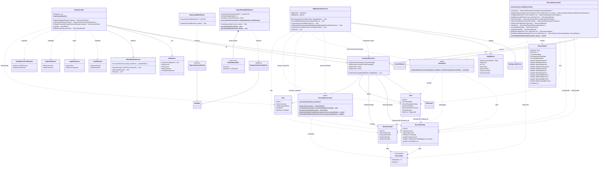

# AirAware Backend – UML-Klassendiagramm

```mermaid
classDiagram
    direction TB

    %% ══════════════════════════════════════════
    %% ENUM
    %% ══════════════════════════════════════════

    class SensorType {
        <<enumeration>>
        Temperature = 0
        Humidity = 1
    }

    %% ══════════════════════════════════════════
    %% MODELS (Entity / DB-Tabellen)
    %% ══════════════════════════════════════════

    class SensorReading {
        +Guid Id
        +string SensorId
        +SensorType Type
        +DateTime Timestamp
        +double? TemperatureC
        +double? TemperatureF [NotMapped, berechnet]
        +double? HumidityPercent
    }

    class AlertThreshold {
        +Guid Id
        +SensorType Type
        +string MetricName
        +double MinValue
        +double MaxValue
    }

    class Alert {
        +Guid Id
        +Guid ReadingId
        +SensorReading Reading
        +Guid ThresholdId
        +AlertThreshold Threshold
        +string Message
        +DateTime TriggeredAt
    }

    class User {
        +Guid Id
        +string Username
        +string PasswordHash
        +string Role
        +DateTime CreatedAt
    }

    class SensorReport {
        +DateTime From
        +DateTime To
        +int TotalReadings
        +int TemperatureReadings
        +int HumidityReadings
        +double? AvgTemperatureC
        +double? MinTemperatureC
        +double? MaxTemperatureC
        +double? MedianTemperatureC
        +double? AvgTemperatureF
        +double? MinTemperatureF
        +double? MaxTemperatureF
        +double? AvgHumidityPercent
        +double? MinHumidityPercent
        +double? MaxHumidityPercent
        +double? MedianHumidityPercent
        +int AlertCount
    }

    %% ══════════════════════════════════════════
    %% DTOs
    %% ══════════════════════════════════════════

    class LoginRequest {
        +string Username
        +string Password
    }

    class LoginResponse {
        +string Token
        +DateTime ExpiresAt
    }

    class RegisterRequest {
        +string Username
        +string Password
    }

    class ChangePasswordRequest {
        +string CurrentPassword
        +string NewPassword
    }

    %% ══════════════════════════════════════════
    %% CONFIGURATION
    %% ══════════════════════════════════════════

    class JwtOptions {
        +string SectionName$ = "Jwt"
        +string Secret
        +string Issuer
        +string Audience
        +int ExpirationMinutes
    }

    class MqttOptions {
        +string SectionName$ = "Mqtt"
        +string Host
        +int Port
        +string Topic
        +string ClientId
        +string Username
        +string Password
    }

    %% ══════════════════════════════════════════
    %% DATA (DbContext)
    %% ══════════════════════════════════════════

    class AirAwareDbContext {
        +DbSet~SensorReading~ SensorReadings
        +DbSet~AlertThreshold~ AlertThresholds
        +DbSet~Alert~ Alerts
        +DbSet~User~ Users
        #OnModelCreating(ModelBuilder modelBuilder) : void
    }

    %% ══════════════════════════════════════════
    %% CONTROLLERS
    %% ══════════════════════════════════════════

    class AuthController {
        -JwtOptions _jwt
        -TimeZoneInfo BerlinTz$
        +Register(RegisterRequest request) : Task~ActionResult~
        +Login(LoginRequest request) : Task~ActionResult~LoginResponse~~
        +ChangePassword(ChangePasswordRequest request) : Task~ActionResult~
        +Logout() : ActionResult
        +DeleteUser(string username) : Task~ActionResult~
    }

    class SensorDataController {
        -HashSet~string~ ValidMetricNames$
        +GetLatest() : Task~ActionResult~IEnumerable~SensorReading~~~
        +GetHistory(SensorType? type, DateTime? from, DateTime? to, int count) : Task~ActionResult~IEnumerable~SensorReading~~~
        +GetReport(DateTime? from, DateTime? to) : Task~ActionResult~SensorReport~~
        +GetReportCsv(DateTime? from, DateTime? to) : Task~IActionResult~
        +GetThresholds() : Task~ActionResult~IEnumerable~AlertThreshold~~~
        +SetThreshold(AlertThreshold threshold) : Task~ActionResult~AlertThreshold~~
        +DeleteThreshold(SensorType type) : Task~ActionResult~
        +GetAlerts() : Task~ActionResult~IEnumerable~Alert~~~
        +GenerateMockData() : Task~ActionResult~
        +DeleteMockData() : Task~ActionResult~
        -BuildReport(DateTime? from, DateTime? to) : Task~SensorReport~
        -BuildReportWithReadings(DateTime? from, DateTime? to) : Task~Tuple~List~SensorReading~, SensorReport~~
        -CalculateMedian(IEnumerable~double~ values)$ : double
    }

    %% ══════════════════════════════════════════
    %% SERVICES
    %% ══════════════════════════════════════════

    class MqttSubscriberService {
        -IMqttClient? _mqttClient
        -MqttOptions _options
        #ExecuteAsync(CancellationToken stoppingToken) : Task
        -ConnectWithRetryAsync(CancellationToken ct) : Task
        -ConnectAsync(CancellationToken ct) : Task
        -OnMessageReceivedAsync(MqttApplicationMessageReceivedEventArgs e) : Task
        +StopAsync(CancellationToken cancellationToken) : Task
        +Dispose() : void
    }

    class TokenBlacklistService {
        -ConcurrentDictionary~string, DateTime~ _revokedTokens
        +Revoke(string jti, DateTime expiresUtc) : void
        +IsRevoked(string jti) : bool
        -Cleanup() : void
    }

    %% ══════════════════════════════════════════
    %% CONVERTER / HELPER
    %% ══════════════════════════════════════════

    class SensorDataConverter {
        <<static>>
        -JsonSerializerOptions JsonOptions$
        +Parse(string rawJson)$ : SensorReading
        +TryParse(string rawJson, out SensorReading? reading)$ : bool
        -ParseSensorType(string? type)$ : SensorType
        -GetStringOrDefault(JsonElement element, string propertyName)$ : string?
        -GetDoubleOrNull(JsonElement element, string propertyName)$ : double?
    }

    class AlertHelper {
        <<static>>
        +EvaluateAlerts(List~SensorReading~ readings, List~AlertThreshold~ thresholds)$ : List~Alert~
    }

    %% ══════════════════════════════════════════
    %% MIDDLEWARE
    %% ══════════════════════════════════════════

    class AdminPinAuthMiddleware {
        -string AdminPinHeaderName$ = "X-Admin-Pin"
        -int MaxFailedAttempts$ = 3
        -TimeSpan LockoutDuration$ = 15min
        -ConcurrentDictionary~string, FailedAttemptInfo~ FailedAttempts$
        +InvokeAsync(HttpContext context) : Task
        -IsLockedOut(string clientIp)$ : bool
        -RecordFailedAttempt(string clientIp)$ : void
    }

    class FailedAttemptInfo {
        <<inner class>>
        +int Count
        +DateTime? LockedUntil
    }

    class ApiKeyAuthMiddleware {
        -string ApiKeyHeaderName$ = "X-Api-Key"
        +InvokeAsync(HttpContext context) : Task
    }

    %% ══════════════════════════════════════════
    %% ATTRIBUTES
    %% ══════════════════════════════════════════

    class RequireAdminPinAttribute {
        <<Attribute>>
    }

    class RequireApiKeyAttribute {
        <<Attribute>>
    }

    %% ══════════════════════════════════════════
    %% VERERBUNG
    %% ══════════════════════════════════════════

    AuthController --|> ControllerBase
    SensorDataController --|> ControllerBase
    MqttSubscriberService --|> BackgroundService
    AirAwareDbContext --|> DbContext
    RequireAdminPinAttribute --|> Attribute
    RequireApiKeyAttribute --|> Attribute

    %% ══════════════════════════════════════════
    %% ASSOZIATIONEN (Felder / Abhängigkeiten)
    %% ══════════════════════════════════════════

    AuthController --> "1" AirAwareDbContext : db
    AuthController --> "1" JwtOptions : _jwt
    AuthController --> "1" TokenBlacklistService : blacklist

    SensorDataController --> "1" AirAwareDbContext : db

    MqttSubscriberService --> "1" MqttOptions : _options
    MqttSubscriberService ..> AirAwareDbContext : erzeugt per Scope

    %% ══════════════════════════════════════════
    %% VERWENDUNGEN (Methoden-Parameter / Returns)
    %% ══════════════════════════════════════════

    AuthController ..> LoginRequest : empfängt
    AuthController ..> LoginResponse : liefert
    AuthController ..> RegisterRequest : empfängt
    AuthController ..> ChangePasswordRequest : empfängt
    AuthController ..> User : liest/schreibt

    SensorDataController ..> SensorReading : liest/schreibt
    SensorDataController ..> AlertThreshold : liest/schreibt
    SensorDataController ..> Alert : liest
    SensorDataController ..> SensorReport : erzeugt
    SensorDataController ..> AlertHelper : ruft auf
    SensorDataController ..> SensorType : filtert nach

    MqttSubscriberService ..> SensorDataConverter : nutzt zum Parsen
    MqttSubscriberService ..> AlertHelper : nutzt zur Alarmauswertung
    MqttSubscriberService ..> SensorReading : erzeugt + speichert
    MqttSubscriberService ..> Alert : erzeugt + speichert
    MqttSubscriberService ..> AlertThreshold : liest

    SensorDataConverter ..> SensorReading : erzeugt
    SensorDataConverter ..> SensorType : verwendet

    AlertHelper ..> SensorReading : prüft
    AlertHelper ..> AlertThreshold : prüft gegen
    AlertHelper ..> Alert : erzeugt

    %% ══════════════════════════════════════════
    %% DB-CONTEXT → ENTITIES
    %% ══════════════════════════════════════════

    AirAwareDbContext --> "*" SensorReading : SensorReadings
    AirAwareDbContext --> "*" AlertThreshold : AlertThresholds
    AirAwareDbContext --> "*" Alert : Alerts
    AirAwareDbContext --> "*" User : Users

    %% ══════════════════════════════════════════
    %% FREMDSCHLÜSSEL (DB-Beziehungen)
    %% ══════════════════════════════════════════

    Alert --> "1" SensorReading : Reading (FK reading_id)
    Alert --> "1" AlertThreshold : Threshold (FK threshold_id)

    %% ══════════════════════════════════════════
    %% ENUM-VERWENDUNG
    %% ══════════════════════════════════════════

    SensorReading --> SensorType : Type
    AlertThreshold --> SensorType : Type

    %% ══════════════════════════════════════════
    %% MIDDLEWARE → ATTRIBUTE
    %% ══════════════════════════════════════════

    AdminPinAuthMiddleware ..> RequireAdminPinAttribute : prüft auf
    AdminPinAuthMiddleware *-- FailedAttemptInfo : innere Klasse
    ApiKeyAuthMiddleware ..> RequireApiKeyAttribute : prüft auf
```
